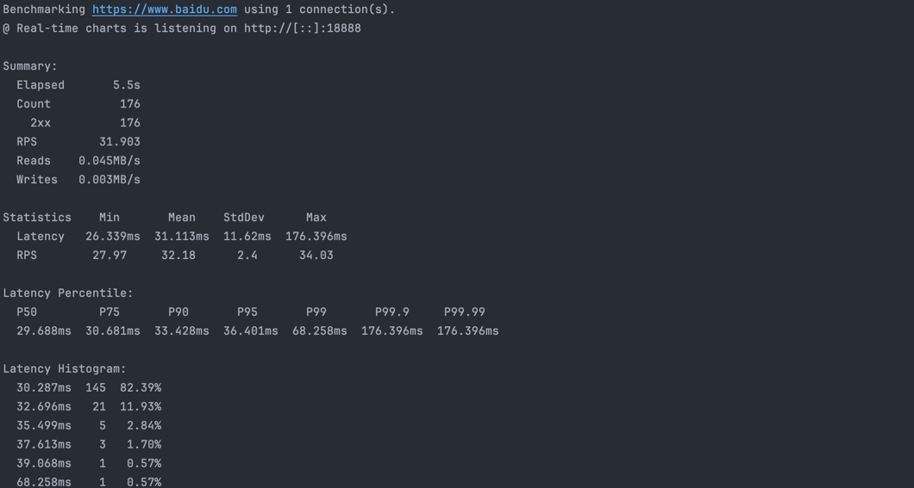

copy from [plow](https://github.com/six-ddc/plow)
add feature
1. 使用随机query
2. 增加路径参数
3.  Response status折线图


## 使用方式
默认可视化端口是18888

### docker
```shell
## 构建镜像
 docker build -t plow:v1 .
 
## help
 docker run -it --rm -p 18888:18888  plow:v1 --help
 
## 简单开始
docker run -it --rm -p 18888:18888  plow:v1 https://www.baidu.com

## 随机query

docker run -it --rm -p 18888:18888  plow:v1 https://www.baidu.com ----use-random-query

## 路径参数
docker run -it --rm -p 18888:18888  plow:v1 https://uat.jinshuju.net/pt/:token ----use-random-query --path-params=token:mockToken

## 设置连接数
docker run -it --rm -p 18888:18888  plow:v1 https://uat.jinshuju.net/pt/:token ----use-random-query --path-params=token:mockToken -c 100
```
### 源码构建
1. 安装go
2. make build

## 输出说明
